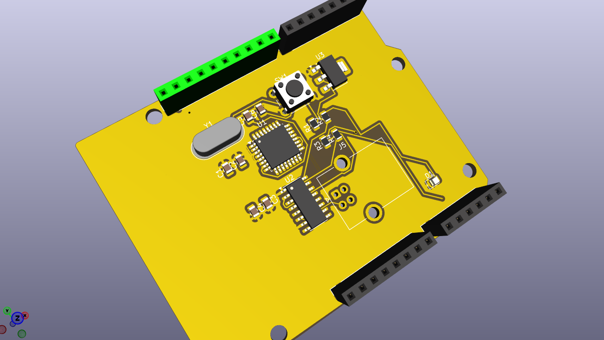
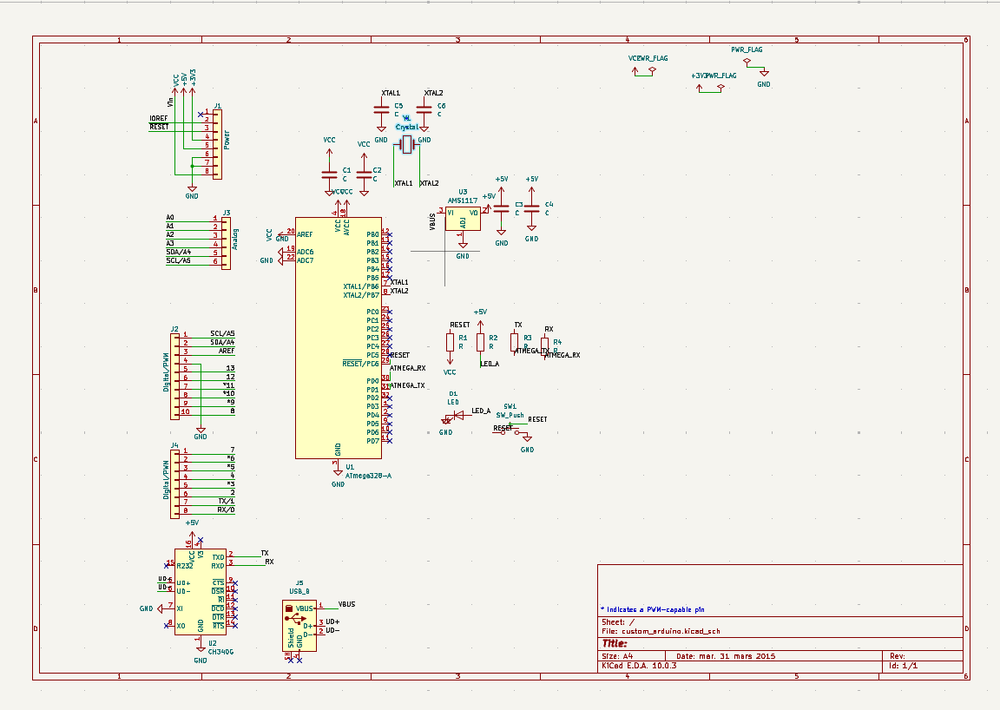
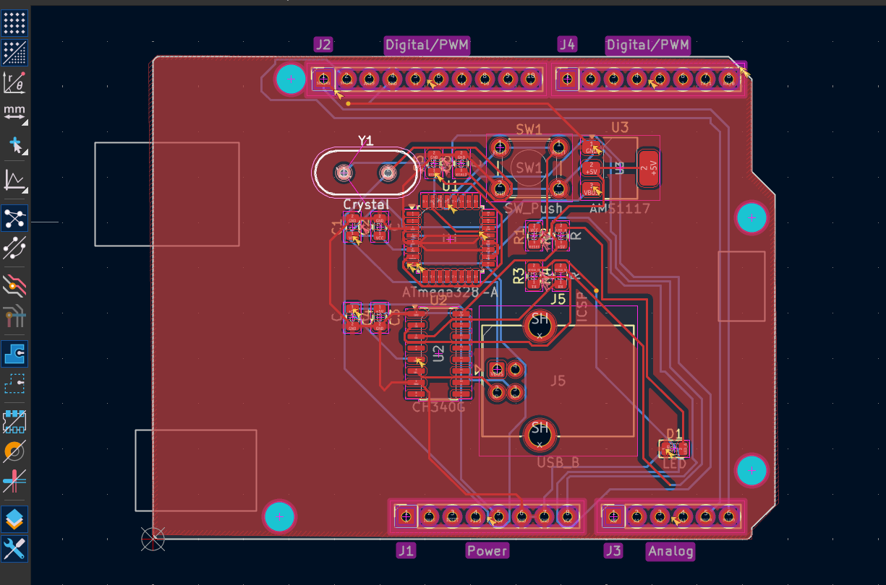

# Custom Arduino-Compatible PCB 🔧

> My first PCB design — built from scratch in KiCad in a single day!

## Overview
A fully custom Arduino Uno-compatible development board 
designed from the ground up using KiCad 10. This project 
was my introduction to professional PCB design and EDA tools.

## What I Built
A custom development board featuring:
- **ATmega328P** — 8-bit AVR microcontroller (same as Arduino Uno)
- **CH340G** — USB to Serial chip for programming via USB
- **AMS1117-5.0** — Voltage regulator for clean 5V power
- **16MHz Crystal** — Clock source for the microcontroller
- **Full Arduino pinout** — Compatible with Arduino shields

## Schematic

## PCB Layout

## PCB Details
| Property | Value |
|----------|-------|
| Board Size | 68.58 × 53.34 mm |
| Layers | 2 (F.Cu + B.Cu) |
| Components | 25 |
| Total Pads | 122 |
| Component Density | 29.42% |

## Design Highlights
- GND copper pour on front layer
- SMD components (0805 package)
- Two-layer manual routing with vias
- ERC verified — 0 errors
- USB Type-B connector for programming

## Tools Used
- **KiCad 10.0** — Schematic + PCB design
- **KiCad 3D Viewer** — 3D visualization

## What I Learned
- Complete schematic capture workflow
- Component symbol and footprint assignment
- PCB layout and component placement
- Net labels and power symbols
- Two-layer PCB routing with vias
- GND copper pour techniques
- ERC and DRC design rule checking
- Gerber file generation

## Project Status
- [x] Schematic design
- [x] ERC check — 0 errors
- [x] Footprint assignment
- [x] PCB component placement
- [x] GND copper pour
- [x] Partial manual routing
- [ ] Complete routing
- [ ] DRC — 0 errors
- [ ] Gerber export
- [ ] PCB fabrication

## Next Steps
- Complete remaining trace routing
- Fix DRC violations
- Order from JLCPCB (~₹300 for 5 boards!)
- Assemble and test

## Author
**[Pavithra K]**
First PCB design — June 2026
